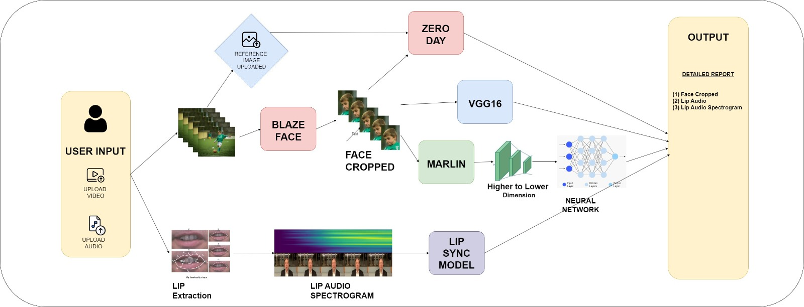

# Smart India Hackathon 2024

## Team CMDSPN

## Problem Statement Code: 1683
### Development of AI/ML based solution for detection of face-swap based deep fake videos
>The rise of synthetically generated audios and videos, or deep fakes, presents a serious challenge, especially given their potential for misuse in politics, fraud, and misinformation. With advances in AI, detecting these manipulated media has become increasingly difficult for security agencies. Deep fakes can now purposefully defame individuals by swapping faces in videos. The need for an advanced forensic technique to authenticate these face-swap deep fakes is pressing. Solutions must combine various AI/ML methods like CNNs, LSTMs, and frequency analysis to deliver accurate detection of these falsified media.

 

## Our Approach:
Current deepfake detection techniques primarily assume that generated videos will mimic previously created ones, which limits their adaptability as deepfake methods evolve. Our approach introduces an ensemble of both data-dependent and data-independent models, combining lip forgery detection and face anomaly detection to create a more comprehensive and robust deepfake detection framework. By leveraging Blaze-Face, VGG16, Marlin, and Lip-Sync models, our solution provides a multi-domain detection approach that covers a wide range of manipulations, ensuring improved accuracy and robustness.

## Architecture

    
    

  
## Demonstration:
- [YouTube Demo Link](https://www.youtube.com/watch?v=PGw7XrgnyE0)

## Use Cases:
### Real-World Applications of Deep Fake Detection:
1. *Content Moderation on Social Media:* Identify and prevent the spread of manipulated media, such as fake lip-sync or face-swapped videos.
2. *Law Enforcement:* Assist in verifying the authenticity of digital evidence in criminal investigations, including cases of identity theft or fraud.
3. *Political Integrity:* Prevent the circulation of misleading deep fakes during political campaigns that could harm public figures.
4. *Reputation Protection:* Detect and mitigate revenge porn or defamatory deep fake content that could harm an individual’s personal or professional life.
5. *Media Verification Tools:* Real-time detection for media outlets to verify the legitimacy of video content before broadcasting.

## Tech-Stack:
- *Blaze-Face*: For face detection and cropping in video frames.
- *VGG16 (Fine-tuned on FF++)*: A CNN-based model fine-tuned on the FF++ dataset for detecting deep fakes.
- *Marlin*: A facial video representation learning model used for learned low-dimensional facial features.
- *Lip-Sync Detection*: Analyzes the synchronization of lip movements with audio to detect inconsistencies.
- *Zero-Day*: A reference image and video comparison model for validating face-swap detection.
- *Python, **TensorFlow, **Keras, **OpenCV, **PyTorch*

## References:
- [MARLIN: Masked Autoencoder for facial video Representation LearnINg](https://github.com/ControlNet/MARLIN?tab=readme-ov-file)
- [MesoNet: A Compact Facial Video Forgery Detection Network](https://github.com/DariusAf/MesoNet)
- [Not made for each other– Audio-Visual Dissonance-based Deepfake Detection](https://arxiv.org/pdf/2005.14405v3)
- [Exposing Lip-syncing Deepfakes from Mouth Inconsistencies](https://arxiv.org/pdf/2311.01458)
- [DeepfakeBench: A Comprehensive Benchmark of Deepfake Detection](https://arxiv.org/pdf/2307.01426)
- [Detecting Deepfakes Without Seeing Any](https://arxiv.org/abs/2401.10113)

## Team:

| S.No. | Team Member Name | Role |
| --------------- | --------------- | --------------- |
| 1. | Maurya Patel | Machine Learning |
| 2. | Chaitanya Patel | Machine Learning |
| 3. | Dhwanan Bharadva | Machine Learning |
| 4. | Smit Shah | Backend Development |
| 5. | Priyanshu Soni | Blockchain |
| 6. | Niyati Pansuriya | UI/UX/Graphics Designer |

